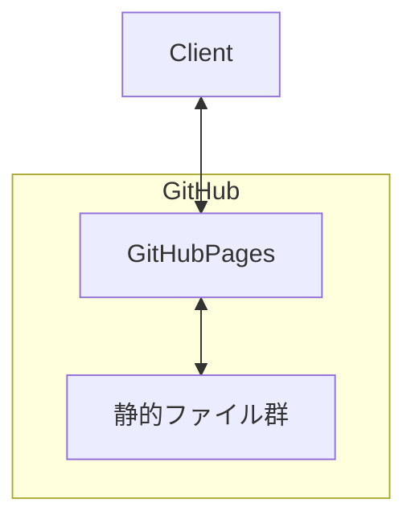
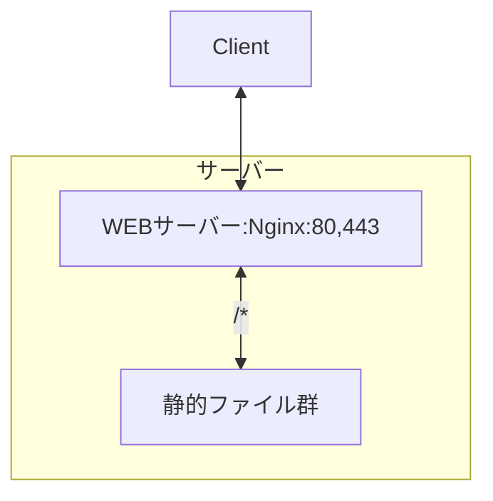
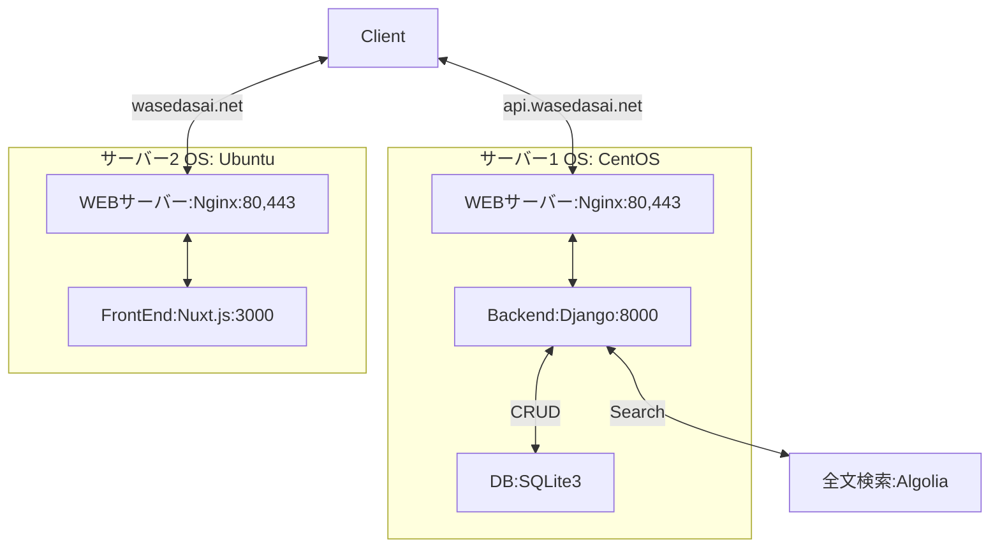

# Infra
この章では、インフラ、サーバーの負荷と基本的なサーバーの取り扱いについて学びます。

## 第一節 インフラ
### インフラとは
インフラは水道・電気・ガスなどの私たちの生活を支える基盤ですが、IT分野（特にWEB）では、インフラはサーバー、データベース、OSやネットワーク構成などのサービスを支える技術群のことを指します。

以下ではWEBサービスを支えるインフラを紹介します。

#### :dizzy: サーバー
あるサービスを提供するものをサーバーと言います。（例えば水を提供するウォーターサーバー）

いわゆるIT分野におけるサーバーは、一般的なPCでも代用可能です。しかし、私たちのPCは大量のユーザーをさばけるほど高性能ではありませんし、壊れてしまえば修復するのに何週間もかかる可能性もあります。そこで専用のコンピュータを用意するのが通常です。

:warning:ややこしいことにサーバーとは、サーバールームにある巨大装置のことを指すだけではありません。WEBサイトやWEBアプリを提供するWEBサーバー、データベースサーバー、メールサーバー、ファイルサーバーなどがあります。

専用のサーバーを管理することは容易ではありません。そのためレンタルサーバーやクラウドサービスを活用し管理は任せてしまうのが良いです。

#### 一般的なサイト制作・アプリ開発に必要なもの
- WEBサーバー
- アプリケーション
- データベース

#### インフラにおける重要な視点
- 運用性
- セキュリティ
- 可用性
- パフォーマンス
- コスト

## 第二節 チームのアーキテクチャ
### 新歓サイト

1日で数万アクセスに達する公式サイトと比較して新歓サイトは負荷が低いのでGitHub Pagesを用いて公開しています。

### 仮サイト

仮サイトはアクセス数の観点でレンタルサーバーで公開します。

### 公式サイト
- フロントエンド：Node.js, PM2, CertBot
- バックエンド：Python, gunicorn, CertBot

公式サイトはアクセス数の観点でレンタルサーバーで公開します。二つのサーバーで公開するのは、バックエンドサーバーが過負荷の場合にフロントエンドサーバー自体が表示できないといった問題を回避するためです。

## 第三節 チームのツール
※StudyBookは公開されています。機密情報の記載は禁止です。
### SFTP
写真・動画・コードなどのファイルを送信する場合はSFTPで転送します。チームはSFTP接続にFileZillaというサービスを使います。

以下の情報を用いてサーバーにアップロードできます。
- ホスト
- ユーザー名
- パスワード
- ポート

### SSH
サーバー内部でサーバーを操作する場合はSSHで操作します。チームはMacならターミナルを、WindowsならTeratermを使います。

以下の情報を用いてサーバーにアップロードできます。
- ホスト
- ユーザー名
- パスワード
- ポート
