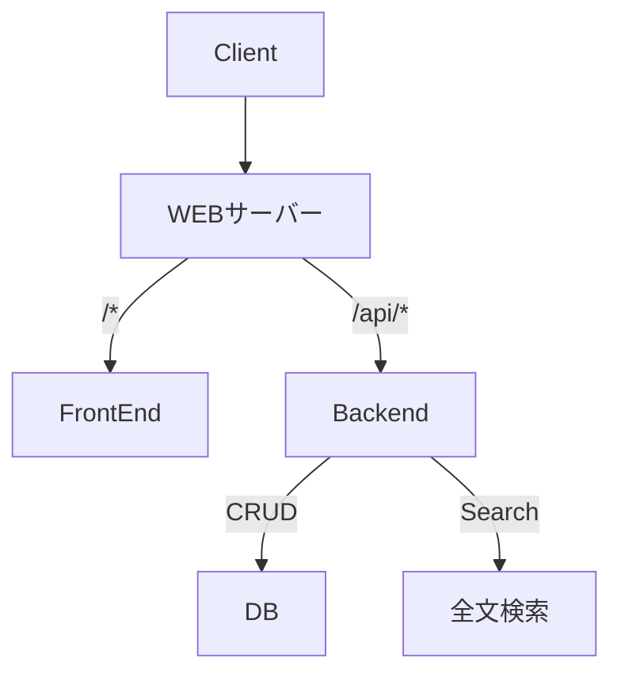

# Infra
この章では、インフラ、サーバーの負荷と基本的なサーバーの取り扱いについて学びます。

## 第一節 インフラ
### インフラとは
インフラは水道・電気・ガスなどの私たちの生活を支える基盤ですが、IT分野（特にWEB）では、インフラはサーバー、データベース、OSやネットワーク構成などのサービスを支える技術群のことを指します。

以下ではWEBサービスを支えるインフラを紹介します。

#### :dizzy: サーバー
あるサービスを提供するものをサーバーと言います。（例えば水を提供するウォーターサーバー）

いわゆるIT分野におけるサーバーは、一般的なPCでも代用可能です。しかし、私たちのPCは大量のユーザーをさばけるほど高性能ではありませんし、壊れてしまえば修復するのに何週間もかかる可能性もあります。そこで専用のコンピュータを用意するのが通常です。

:warning:ややこしいことにサーバーとは、サーバールームにある巨大装置のことを指すだけではありません。WEBサイトやWEBアプリを提供するWEBサーバー、データベースサーバー、メールサーバー、ファイルサーバーなどがあります。

専用のサーバーを管理することは容易ではありません。そのためレンタルサーバーやクラウドサービスを活用し管理は任せてしまうのが良いです。

#### 一般的なサイト制作・アプリ開発に必要なもの
- WEBサーバー
- アプリケーション
- データベース

#### インフラにおける重要な視点
- 運用性
- セキュリティ
- 可用性
- パフォーマンス
- コスト

## 第二節 チームのアーキテクチャ

